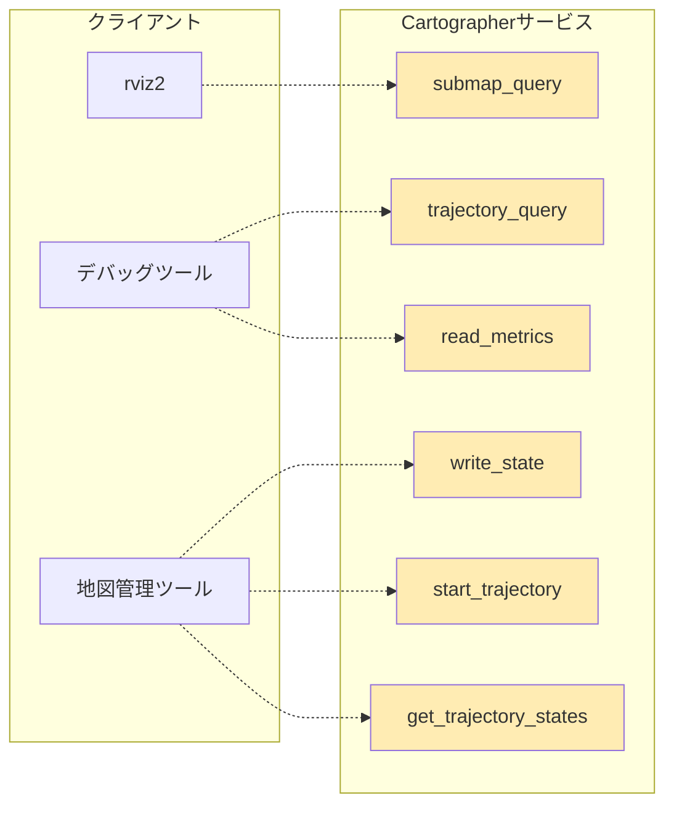

# 遠隔操作ロボット制御ソフトウェア要件定義書

## 1. 概要

### 1.1 プロジェクト目的
本プロジェクトは、福島第一原子力発電所2号機におけるデブリ採取作業を目的とした、遠隔操作ロボットの制御ソフトウェアを開発する。
線量の比較的低い安全なエリアに「親機」を設置し、そこから耐放射線性を高めるために電子回路を極力削減した「子機」をデブリ近傍へ投入する。オペレーターは、操作用PCからロボットを遠隔操作し、デブリの回収作業を行う。

### 1.2 システム構成概要
本システムは、以下の4つの要素で構成される。

-   **操作用PC**: オペレーターがロボットの操作と状態監視を行う。
-   **オンボードPC (Raspberry Pi 4B)**: 親機に搭載され、センサー情報の取得とSTM32 Nucleoへの指令送信を担う。
-   **親機ロボット**: バッテリー、モータードライバ、各種センサーを搭載したクローラ型ロボット。
-   **子機ロボット**: デブリ回収機構を備え、モーターとカメラのみを搭載したシンプルなクローラ型ロボット。

---

## 2. システム構成

### 2.1 ハードウェア構成
-   **操作用PC**: Ubuntu 22.04, ROS 2 Humble
-   **オンボードPC**: Raspberry Pi 4B, Ubuntu 22.04, ROS 2 Humble
-   **コントローラー**: DUALSHOCK 4 (操作用PCにUSB接続)
-   **制御マイコン**: STM32 Nucleo (CAN通信で指令を受信し、モータードライバを制御)
-   **親機センサー**:
    -   USB Webカメラ x 2 (前方・後方)
    -   2D LiDARセンサー (USB接続)
    -   IMU (I2C接続)
-   **子機センサー**:
    -   USB Webカメラ x 1 (前方)
-   **アクチュエータ**:
    -   親機用モーター (STM32 Nucleo経由で制御) x 2
    -   子機用モーター (STM32 Nucleo経由で制御) x 2
    -   デブリ回収用ブラシモーター (STM32 Nucleo経由で制御) x 2
    -   デブリ回収用蓋サーボモーター (RPiのGPIO接続) x 1
-   **その他**:
    -   シリアル-CAN変換基板 (RPiとSTM32 Nucleoの間に接続)

### 2.2 ソフトウェア構成 (ROS 2 ノード)

<iframe style="border: 1px solid rgba(0, 0, 0, 0.1);" width="800" height="450" src="https://embed.figma.com/board/OCDismRVuq7uSEGfK4WbfH/Hairobo_ROS2_diagram?node-id=0-1&embed-host=share" allowfullscreen></iframe>

#### 2.2.0 ROS 2システム構成図

```mermaid
graph TB
    %% コントローラー入力
    CONTROLLER[DUALSHOCK 4] --> joy_node[joy_node]
    
    %% 操作用PC側ノード群
    subgraph PC["操作用PC (Ubuntu 22.04, ROS 2 Humble)"]
        subgraph TELEOP["hairobo_teleop"]
            joy_node --> teleop_logic_node[teleop_logic_node]
        end
        
        subgraph VIZ["hairobo_visualization"]
            rviz2[rviz2]
            image_republish[image_transport/republish]
        end
        
        subgraph SLAM["hairobo_slam"]
            cartographer_node[cartographer_node]
            cartographer_occupancy_grid_node[cartographer_occupancy_grid_node]
            map_server_node[map_server_node]
        end
        
        subgraph LAUNCH_PC["hairobo_launch"]
            launch_pc[launch files]
        end
    end
    
    %% Raspberry Pi側ノード群
    subgraph RPI["Raspberry Pi 4B (Ubuntu 22.04, ROS 2 Humble)"]
        subgraph SENSORS["hairobo_sensors"]
            parent_cam_front[parent_camera_front_node]
            parent_cam_rear[parent_camera_rear_node]
            child_cam_front[child_camera_front_node]
            lidar_sdk_node[lidar_sdk_node]
            imu_node[imu_node]
        end
        
        subgraph DRIVER["hairobo_driver"]
            robot_driver_node[robot_driver_node]
            status_publisher_node[status_publisher_node]
        end
        
        subgraph BRINGUP["hairobo_bringup"]
            launch_rpi[launch files]
        end
    end
    
    %% ハードウェア
    subgraph HW["ハードウェア"]
        CAM_PF[親機前方カメラ]
        CAM_PR[親機後方カメラ]
        CAM_CF[子機前方カメラ]
        LIDAR[2D LiDAR]
        IMU[IMU]
        STM32[STM32 Nucleo]
        SERVO[サーボモーター]
    end
    
    %% トピック接続
    teleop_logic_node -->|/parent/cmd_vel| robot_driver_node
    teleop_logic_node -->|/child/cmd_vel| robot_driver_node
    teleop_logic_node -->|/recovery_mechanism/command| robot_driver_node
    
    parent_cam_front -->|/parent/camera_front/image_compressed| image_republish
    parent_cam_rear -->|/parent/camera_rear/image_compressed| image_republish
    child_cam_front -->|/child/camera_front/image_compressed| image_republish
    
    lidar_sdk_node -->|/point_cloud2| cartographer_node
    imu_node -->|/imu| cartographer_node
    imu_node -->|/imu| robot_driver_node
    robot_driver_node -->|/odom| cartographer_node
    
    cartographer_node -->|/submap_list| cartographer_occupancy_grid_node
    cartographer_occupancy_grid_node -->|/map| rviz2
    
    status_publisher_node -->|/robot_status| rviz2
    
    %% ハードウェア接続
    CAM_PF --> parent_cam_front
    CAM_PR --> parent_cam_rear
    CAM_CF --> child_cam_front
    LIDAR --> lidar_sdk_node
    IMU --> imu_node
    robot_driver_node --> STM32
    robot_driver_node --> SERVO
    
    %% ネットワーク境界
    classDef pcNode fill:#e1f5fe
    classDef rpiNode fill:#f3e5f5
    classDef hwNode fill:#fff3e0
    classDef topicNode fill:#e8f5e8
    
    class joy_node,teleop_logic_node,rviz2,image_republish,cartographer_node,cartographer_occupancy_grid_node,map_server_node pcNode
    class parent_cam_front,parent_cam_rear,child_cam_front,lidar_sdk_node,imu_node,robot_driver_node,status_publisher_node rpiNode
    class CAM_PF,CAM_PR,CAM_CF,LIDAR,IMU,STM32,SERVO hwNode
```

#### 2.2.1 主要サービス構成図

#### 2.2.1 操作用PC側パッケージ構成

**hairobo_teleop パッケージ**
-   **joy_node**: DUALSHOCK 4の入力を`/joy`トピックとして配信する。
-   **teleop_logic_node**: `/joy`を購読し、操作モードに応じて各指令トピックを配信する。

**hairobo_visualization パッケージ**
-   **rviz2**: 各種センサーデータ、地図、ロボットの状態を統合的に可視化する。
-   **image_transport/republish**: RPiから送られてくる圧縮画像を展開し、RViz2で表示可能なraw画像に変換する。

**hairobo_slam パッケージ**
-   **cartographer_node**: RPiから送られてくるLiDARとIMUデータに基づき、Google Cartographerを用いたSLAM（自己位置推定と地図作成）を実行する。
-   **cartographer_occupancy_grid_node**: Cartographerが生成するサブマップを占有格子地図（OccupancyGrid）に変換し、ナビゲーションで使用可能な形式で配信する。
-   **map_server_node**: 作成された地図を保存・読み込みする機能を提供する。

**hairobo_launch パッケージ**
-   操作用PC側の全ノードを起動するためのlaunchファイルを提供する。

#### 2.2.2 Raspberry Pi側パッケージ構成

**hairobo_sensors パッケージ**
-   **camera_nodes (3つ)**: 各USBカメラの映像をハードウェアエンコードで圧縮し、`/image_compressed`形式で配信する。
-   **lidar_sdk_node**: LiDARから点群データを取得し、`/point_cloud2`トピックで配信する。
-   **imu_node**: IMUから角速度・加速度データを取得し、`/imu`トピックで配信する。

**hairobo_driver パッケージ**
-   **robot_driver_node**: PCからの指令を購読し、STM32 Nucleoへのシリアル通信コマンド（0～1の速度指令など）とGPIO信号に変換して制御指令を送信する。また、IMUデータとモーター指令値を統合してオドメトリを推定し、`/odom`トピックを配信する。
-   **status_publisher_node**: バッテリー電圧やモーターの電流値などを監視し、`/robot_status`トピックで配信する。

**hairobo_bringup パッケージ**
-   Raspberry Pi側の全ノードを起動するためのlaunchファイルを提供する。

#### 2.2.3 共通パッケージ

**hairobo_msgs パッケージ**
-   プロジェクト固有のカスタムメッセージ型とサービス定義を提供する。
-   型安全な通信を実現するため、`hairobo_msgs/RecoveryCommand` や `hairobo_msgs/RobotStatus` といったカスタムメッセージ型を定義する。

### 2.3 ネットワーク構成
操作用PCとRaspberry Piは有線LANで接続し、固定IPアドレスを割り当てることで安定した通信を確保する。

---

## 3. 機能要件

### 3.1 遠隔操作機能
-   DUALSHOCK 4のスティックで、選択中の機体の前後左右移動を制御できること（差動二輪制御）。
-   □ボタンで「親機操作モード」、△ボタンで「子機操作モード」に切り替えること。一度モードを切り替えると、もう片方のボタンが押されるまでその状態は維持される（トグル方式）。
-   optionボタンでデブリ回収機構のブラシモーターのON/OFFを切り替えられること。
-   shareボタンでデブリ回収機構の蓋サーボの開閉を切り替えられること。

### 3.2 センサーデータ取得・配信機能
-   RPiは、3台のUSBカメラから毎秒15フレーム以上の映像を取得し、H.264形式に圧縮してPCに配信すること。
-   RPiは、LiDARから点群データを取得し、PCに配信すること。

### 3.3 自己位置推定・環境地図作成機能 (SLAM)
-   PCは、RPiから受信したLiDARの点群データとIMUデータを用いて、Google Cartographerによる高精度なSLAMを実行すること。
-   Cartographerのループクロージャ機能により、長時間の走行における誤差蓄積を抑制し、一貫性のある地図を生成すること。
-   生成された地図は、占有格子地図（OccupancyGrid）形式でナビゲーションシステムで利用可能であること。
-   地図作成中もリアルタイムで自己位置推定を継続し、オペレーターが現在位置を把握できること。
-   作成された地図は保存・読み込みが可能であり、後の作業で再利用できること。

### 3.4 地図保存・管理機能
-   作成されたSLAM地図を.pgmおよび.yaml形式で保存できること。
-   保存された地図を再度読み込み、既知環境でのローカライゼーション（自己位置推定のみ）ができること。
-   複数の地図を管理し、作業エリアに応じて適切な地図を選択して使用できること。

### 3.5 状態監視・可視化機能
-   オペレーターは、操作用PCのRViz2画面で以下の情報を同時に監視できること。
    -   3台のカメラ映像
    -   LiDARの点群データ（リアルタイム表示）
    -   Cartographerによって生成された環境地図（サブマップと統合地図の両方）
    -   地図上でのロボットの現在位置と向き（軌跡の表示も含む）
    -   ロボットのステータス情報（操作モード、バッテリー電圧、警告など）
    -   SLAMの実行状態（マッピング中/ローカライゼーション中の表示）

---

## 4. ROS 2インターフェース仕様

### 4.1 トピック一覧
| トピック名                              | メッセージ型                   | 説明                                                            |
| --------------------------------------- | ------------------------------ | --------------------------------------------------------------- |
| `/joy`                                  | `sensor_msgs/Joy`              | DUALSHOCK 4の入力                                               |
| `/parent/cmd_vel`                       | `geometry_msgs/Twist`          | 親機の速度指令 (線形速度x, 角速度zは-1.0～1.0の範囲)            |
| `/child/cmd_vel`                        | `geometry_msgs/Twist`          | 子機の速度指令 (線形速度x, 角速度zは-1.0～1.0の範囲)            |
| `/recovery_mechanism/command`           | `hairobo_msgs/RecoveryCommand` | 回収機構（ブラシ、蓋）へのON/OFF指令                            |
| `/parent/camera_front/image_compressed` | `sensor_msgs/CompressedImage`  | 親機前方カメラの圧縮映像                                        |
| `/parent/camera_rear/image_compressed`  | `sensor_msgs/CompressedImage`  | 親機後方カメラの圧縮映像                                        |
| `/child/camera_front/image_compressed`  | `sensor_msgs/CompressedImage`  | 子機前方カメラの圧縮映像                                        |
| `/point_cloud2`                         | `sensor_msgs/PointCloud2`      | LiDARの点群データ                                               |
| `/imu`                                  | `sensor_msgs/Imu`              | IMUからの角速度・加速度データ                                   |
| `/odom`                                 | `nav_msgs/Odometry`            | IMUデータとモーター指令値から推定した走行距離情報               |
| `/map`                                  | `nav_msgs/OccupancyGrid`       | Cartographerが生成した占有格子地図                               |
| `/submap_list`                          | `cartographer_ros_msgs/SubmapList` | Cartographerのサブマップ情報                                  |
| `/trajectory_node_list`                 | `cartographer_ros_msgs/TrajectoryNodeList` | Cartographerの軌跡ノード情報                              |
| `/landmark_poses_list`                  | `cartographer_ros_msgs/LandmarkList` | Cartographerのランドマーク情報                               |
| `/constraint_list`                      | `cartographer_ros_msgs/ConstraintList` | Cartographerの制約情報                                     |
| `/tf`                                   | `tf2_msgs/TFMessage`           | 座標系間の関係                                                  |
| `/robot_status`                         | `hairobo_msgs/RobotStatus`     | 各種ステータス情報（バッテリー電圧、操作モード等）              |

### 4.2 サービス一覧
| サービス名                              | サービス型                               | 説明                                                            |
| --------------------------------------- | ---------------------------------------- | --------------------------------------------------------------- |
| `/submap_query`                         | `cartographer_ros_msgs/SubmapQuery`     | 特定のサブマップの詳細情報を取得                                |
| `/start_trajectory`                     | `cartographer_ros_msgs/StartTrajectory` | 新しい軌跡の開始                                                |
| `/trajectory_query`                     | `cartographer_ros_msgs/TrajectoryQuery` | 軌跡情報の取得                                                  |
| `/write_state`                          | `cartographer_ros_msgs/WriteState`      | Cartographerの状態をファイルに保存                              |
| `/get_trajectory_states`                | `cartographer_ros_msgs/GetTrajectoryStates` | 軌跡の状態を取得                                            |
| `/read_metrics`                         | `cartographer_ros_msgs/ReadMetrics`     | Cartographerのメトリクス情報を取得                              |

### 4.3 ノード入出力仕様

#### 4.3.1 操作用PC側ノード

| ノード名 | パッケージ | 入力トピック | 出力トピック | 説明 |
|---------|-----------|-------------|-------------|------|
| `joy_node` | hairobo_teleop | なし | `/joy` | DUALSHOCK 4からの入力を配信 |
| `teleop_logic_node` | hairobo_teleop | `/joy` | `/parent/cmd_vel` `/child/cmd_vel` `/recovery_mechanism/command` | コントローラー入力を各種制御指令に変換 |
| `rviz2` | hairobo_visualization | 全てのセンサー・状態トピック | なし | 統合的な可視化インターフェース |
| `image_transport/republish` | hairobo_visualization | `/parent/camera_front/image_compressed` `/parent/camera_rear/image_compressed` `/child/camera_front/image_compressed` | `/parent/camera_front/image_raw` `/parent/camera_rear/image_raw` `/child/camera_front/image_raw` | 圧縮画像をraw画像に変換 |
| `cartographer_node` | hairobo_slam | `/point_cloud2` `/imu` `/odom` | `/submap_list` `/trajectory_node_list` `/landmark_poses_list` `/constraint_list` `/tf` | SLAM実行と地図生成 |
| `cartographer_occupancy_grid_node` | hairobo_slam | `/submap_list` | `/map` | サブマップを占有格子地図に変換 |
| `map_server_node` | hairobo_slam | なし | `/map` `/map_metadata` | 保存された地図の読み込み・配信 |

#### 4.3.2 Raspberry Pi側ノード

| ノード名 | パッケージ | 入力トピック | 出力トピック | 説明 |
|---------|-----------|-------------|-------------|------|
| `parent_camera_front_node` | hairobo_sensors | なし | `/parent/camera_front/image_compressed` | 親機前方カメラ映像の圧縮配信 |
| `parent_camera_rear_node` | hairobo_sensors | なし | `/parent/camera_rear/image_compressed` | 親機後方カメラ映像の圧縮配信 |
| `child_camera_front_node` | hairobo_sensors | なし | `/child/camera_front/image_compressed` | 子機前方カメラ映像の圧縮配信 |
| `lidar_sdk_node` | hairobo_sensors | なし | `/point_cloud2` | LiDAR点群データの取得・配信 |
| `imu_node` | hairobo_sensors | なし | `/imu` | IMU角速度・加速度データの取得・配信 |
| `robot_driver_node` | hairobo_driver | `/parent/cmd_vel` `/child/cmd_vel` `/recovery_mechanism/command` `/imu` | `/odom` STM32 Nucleoへのシリアル通信 GPIOサーボ制御 | モーター制御とオドメトリ推定 |
| `status_publisher_node` | hairobo_driver | なし | `/robot_status` | バッテリー電圧・システム状態の監視・配信 |

#### 4.3.3 TFツリー
`map` -> `odom` -> `base_link` -> `lidar_link`, `camera_link`, etc.

---

## 5. 非機能要件

### 5.1 起動の容易性と即時性
-   操作用PC側、Raspberry Pi側の両方のソフトウェアは、それぞれ単一のコマンドで全ての関連ノードを起動できること。
-   ROS 2のLaunch System (`ros2 launch`) を活用し、システムの起動手順を自動化する。
-   これにより、ヒューマンエラーを排除し、いかなる時でも迅速かつ確実にオペレーションを開始できる状態を保証する。

### 5.2 堅牢性と異常系要件
-   システムは、一時的なネットワークの切断やノードの再起動に対して、可能な限り堅牢であること。
-   各ROS 2ノードは、通信相手が一時的に不在になった場合でも、異常終了することなく再接続を試みる設計とする。
-   システム全体として、長時間安定して稼働し続けることを目指す。
-   **異常時の振る舞いを以下のように定める**:
    -   **通信途絶時**: 操作PCとオンボードPC間の通信が一定時間途絶えた場合、親機および子機のモーターは全て安全に停止する。
    -   **バッテリー低下時**: バッテリー電圧が規定の閾値を下回った場合、`/robot_status`を通じて警告を発し、RViz2上に通知を表示する。
    -   **センサー異常時**: 主要なセンサー（LiDARやカメラ）からのデータが途絶えた場合、RViz2上で該当センサーの状態をエラー表示する。

### 5.3 SLAM性能要件
-   Cartographerは、リアルタイムでの地図生成と自己位置推定を実行し、LiDARデータの処理遅延を最小限に抑えること。
-   ループクロージャの検出と実行により、大規模環境においても地図の一貫性を保持すること。
-   地図の解像度は作業に必要な精度（推奨：0.05m/pixel）を確保し、デブリ回収作業に支障をきたさないこと。
-   長時間の運用においても、メモリ使用量の増大を適切に管理し、システムの安定性を維持すること。

### 5.4 パフォーマンスリスク
-   オンボードPC (Raspberry Pi 4B) は、4台のカメラ映像のリアルタイム・ハードウェアエンコード、LiDARデータ処理、モーター制御指令の送受信を同時に担うため、高い処理負荷が想定される。
-   操作用PCは、Cartographerによる高負荷なSLAM処理を実行するため、十分な計算リソース（CPU、メモリ）を確保する必要がある。
-   開発の初期段階で、これらの処理を同時に実行しても性能要件（特にカメラのフレームレート15fps以上、SLAMのリアルタイム性）を満たせるかを確認するための**技術検証（Proof of Concept）**を実施する。性能が不足する場合は、より高性能なハードウェアの検討や、処理の分散などの対策を講じる。

## 6. Cartographer設定要件

### 6.1 基本設定
-   **地図解像度**: 0.05m/pixelでの高精度地図作成を行うこと。
-   **LiDARセンサー設定**: 2D LiDARの仕様に合わせた適切な角度範囲と距離範囲を設定すること。
-   **IMUデータ統合**: IMUからの角速度・加速度データを適切に統合し、SLAM精度を向上させること。

### 6.2 パフォーマンス調整
-   **サブマップサイズ**: 処理能力とメモリ使用量を考慮した適切なサブマップサイズを設定すること。
-   **ループクロージャ頻度**: 環境に応じてループクロージャの実行頻度を調整し、処理負荷と地図品質のバランスを取ること。
-   **リアルタイム制約**: リアルタイム処理を優先し、必要に応じて地図品質よりも応答性を重視した設定とすること。

### 6.3 可視化設定
-   **RViz2プラグイン**: Cartographer専用のRViz2プラグインを使用し、サブマップや軌跡の詳細な可視化を実現すること。
-   **デバッグ情報**: 開発・デバッグ時には、制約情報やランドマーク情報も表示できるよう設定すること。

## 7.その他
### 7.1 ドキュメント
- ドキュメントはVitepressを用いたモダンなものを作成する。
